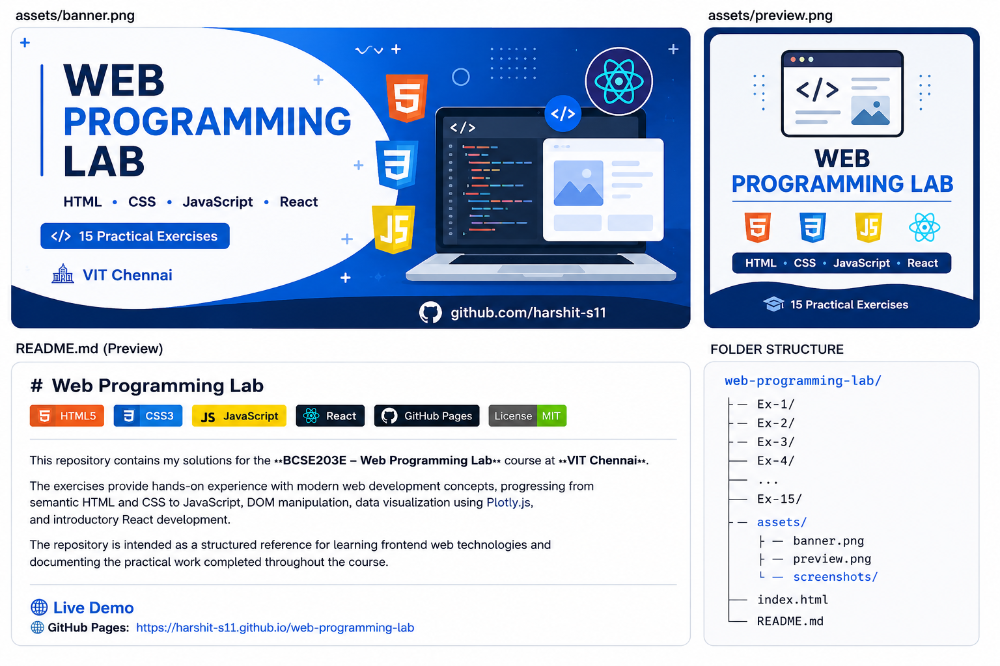

<p align="center">
  
</p>

# Web Programming Lab

<p align="center">


</p>

This repository contains my solutions for the **BCSE203E – Web Programming Lab** course at **VIT Chennai**.

The exercises provide hands-on experience with modern web development concepts, progressing from semantic HTML and CSS to JavaScript, DOM manipulation, data visualization using Plotly.js, and introductory React development.

The repository serves as a structured reference for learning frontend web technologies and documents the practical work completed throughout the course.

---

# 🌐 Live Demo

> **GitHub Pages:**  
> https://harshit-s11.github.io/WebP-Ex-Solutions/

---

# 📚 Course Information

| Field | Details |
|-------|---------|
| Student | Harshit Sharma |
| Registration Number | 23BCE1390 |
| Course | BCSE203E – Web Programming Lab |
| University | VIT Chennai |

---

# 🎯 Learning Outcomes

Through these exercises, I gained practical experience with:

- Semantic HTML5
- Responsive CSS3
- JavaScript (ES6)
- DOM Manipulation
- Client-side Form Validation
- Plotly.js Data Visualization
- React Fundamentals
- React Components
- JSX
- Responsive Web Design

---

# 🛠 Technologies Covered

- HTML5
- CSS3
- JavaScript (ES6)
- DOM Manipulation
- Forms & Validation
- Plotly.js
- React (JSX)

---

# 📂 Exercise Index

| Exercise | Topic |
|-----------|-------|
| 1 | HTML Basics |
| 2 | Tables & Lists |
| 3 | Image Mapping |
| 4 | Forms |
| 5 | Frames |
| 6 | CSS Fundamentals |
| 7 | Advanced CSS |
| 8 | JavaScript Basics |
| 9 | JavaScript Applications |
| 10 | Functions & Forms |
| 11 | Dynamic DOM Manipulation |
| 12 | Plotly.js |
| 13 | React JSX Basics |
| 14 | React Components |
| 15 | React Applications |

---

# 📁 Repository Structure

```text
web-programming-lab/
│
├── Ex-1/
├── Ex-2/
├── Ex-3/
├── Ex-4/
├── Ex-5/
├── Ex-6/
├── Ex-7/
├── Ex-8/
├── Ex-9/
├── Ex-10/
├── Ex-11/
├── Ex-12/
├── Ex-13/
├── Ex-14/
├── Ex-15/
│
├── assets/
│   ├── banner.png
│   ├── preview.png
│   └── screenshots/
│
├── index.html
└── README.md
```

---

# 🚀 Getting Started

## Clone the Repository

```bash
git clone https://github.com/harshit-s11/WebP-Ex-Solutions.git
```

Open `index.html` in your browser.

---

## Running React Exercises

```bash
cd Ex-13/my-app
npm install
npm start
```

---

# 💡 Highlights

✔ 15 Practical Exercises

✔ HTML5 & CSS3 Fundamentals

✔ Modern JavaScript (ES6)

✔ DOM Manipulation

✔ Client-side Form Validation

✔ Interactive Charts using Plotly.js

✔ React Fundamentals

✔ Responsive Web Development

---

# 🎓 Academic Context

This repository was developed as part of the **BCSE203E – Web Programming Lab** course at **VIT Chennai**.

It serves as a reference for the practical exercises completed throughout the semester and demonstrates the progression from static web pages to interactive frontend web applications using modern web technologies.

---

# 📜 License

This project is licensed under the **MIT License**.

---

# 👨‍💻 Author

**Harshit Sharma**

Final-year B.Tech Computer Science Engineering Student

VIT Chennai

🔗 GitHub: https://github.com/harshit-s11

🔗 LinkedIn: https://linkedin.com/in/harshit-sharma24

---

⭐ If you found this repository useful, consider giving it a star.
